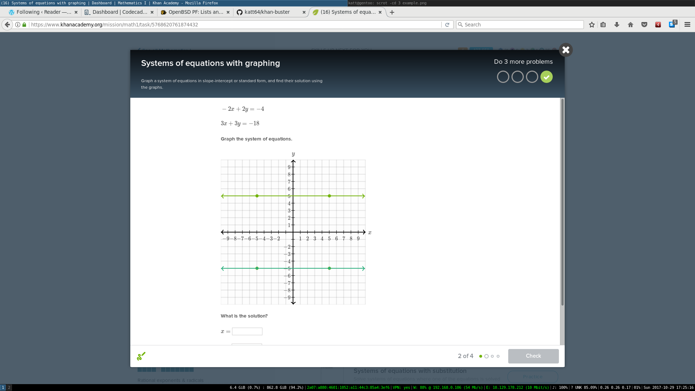

# System of Equations with graphing

<a href="docs/example.png" target="_blank"></a>

## Introduction
Most of the time, Khan Academy gives you a system of 2 equations in the form of
*ax + by = c*, where the values of *a*, *b*, and *c* are given, leaving *x* and
*y* as variables of the system. Then, it asks you to plot the two equations on
the line graph and asks you to solve for *x* and *y* (equivalently speaking,
where on the cartesian plane the plots intersect).

In the subsubsections below, we will look at the preconditions and
postconditions.

### Inputs
In an equation of the form *ax + by = c*, where the values of *a*, *b*, and *c*
are given, leaving *x* and *y* as variables of the system; the values we should
be aware of and take into consideration are a, b, and c. Take in inputs in this
manner for both of the equations.

The preconditions are:

* In an equation of the form *ax + by = c*, where the values of *a*, *b*, and
  *c* are given, leaving *x* and *y* as variables of the system.
* For the two equations in the system, Gaussian elimination is possible and that
  there is a real solution.

### Methodology
To plot both equations on the line graph, in an equation of the form *ax + by =
c*, where the values of *a*, *b*, and *c* are given, leaving *x* and *y* as
variables of the system; we will try to get rid of the *&plusmn; by* term from
the lhs (left-hand side) of the equation and isolate it on the rhs (right-hand
side) of the equation.

Thus, the lhs will be in the form of *mx + c* and the rhs will be in the form of
*y*, giving the standard form of a slope. The y-intercept (when *x = 0*) shall
be equal to the term *&plusmn; c*, and the slope shall be defined by the
coefficient *m*.

To find the solution to the system of equation (*x* and *y*), perform Gaussian
elimination.

### Outputs
Our outputs shall be the graph plot with the help of some algebra described in
the Methodology above. Our outputs shall also be the values (*x* and *y*) where
the lines intersect, which is determined by Gaussian elimination.

The postconditions are:

* The plotted graph shows two lines intersecting at some point on the cartesian
  plane.
* *x* and *y* are the only real solution.

## Implementations
The first program was implemented for this problem on October 30, 2017. Below
is a list of all the implementations and how they can be utilized.

### Pari/GP

The directory for this implementation of this subject matter relative to this
documentation is `gp/`.

#### Prerequisites
You will need the following tools installed on your environment:

- Pari/GP 2.9.3 (>=sci-mathematics/pari-2.9.3) or later.

These are the recommended requirements, not minimum ones. In this environment,
it has been tested and worked as put out.

#### Usage
Assuming you are in the root directory of this implementation on this subject
matter, which is wherein the Pari/GP script resides. Run `gp -q main.gp`,
where `gp` is the command to invoke the Great Programmable calculator and `-q`
parses the option for the software to be more terse.

Once executed, follow the instructions and provide necessary inputs as prompted
interactively. Guidelines for inputs are given in &sect;Introduction > Inputs.
Make very sure that the preconditions are met, so the postconditions are met as
well (see &sect;Introduction > Outputs).

After you've entered the the system of equations, you will be given the
slope-intercept *y = mx + c* form of the equations in the system.
This is your first output and they are to be used to aid plotting the graph.
Then, you will be given the values of *x* and *y* representing the intersection
point of the plots. They are given in the form of a 2-tuple and mean (*x*, *y*).
Simply copy the corresponding values.

After execution, the instance of the program will quit automatically. If you do
not want this to happen, delete the line containing the statement `quit();`
within `main.gp`. However, this will lead you to the Pari/GP prompt, not back in
the program.

#### Examples

```
$ gp -q main.gp
Enter equation #1 of the system.
a? 2
b? 3
c? 4
Enter equation #2 of the system.
a? 3
b? 4
c? 5
Equation 1	y = -2/3*x + 4/3
Equation 2	y = -3/4*x + 5/4
The solution vector is: [-1, 2]~
```

#### Bugs
None.

#### Authors

- Stephanie Björk; October, 30 2017

### JavaScript
The directory for this implementation of this subject matter relative to this
documentation is `js/`.

#### Prerequisites
You will need the following tools installed on your environment:

- Node.js version 6.9.4 (>=net-libs/nodejs-6.9.4) or later.

These are the recommended requirements, not minimum ones. In this environment,
it has been tested and worked as put out.

#### Usage
Assuming you are in the root directory of this implementation on this subject
matter, which is wherein the JavaScript program resides. Do **not** run `node
main.js` yourself &mdash; the program will not listen to your inputs or work at
all. You must execute the shell script `main` with `./main`. The script acts as
a wrapper for the JavaScript program, listens for input, and manages I/O
conveniently and consistently.

If you are concerned about your safety vis-&agrave;-vis shell scripts (you
should be!), feel free to examine the shell script yourself. *Never* ever run any
shell scripts, including this one, as root. Luckily enough, this shell script
also stops you from (accidentally) running as root.

Once executed, follow the instructions and provide necessary inputs as prompted
interactively. Guidelines for inputs are given in &sect;Introduction > Inputs.
Make very sure that the preconditions are met, so the postconditions are met as
well (see &sect;Introduction > Outputs).

After you've entered the the system of equations, you will be given the
slope-intercept *y = mx + c* form of the equations in the system.
This is your first output and they are to be used to aid plotting the graph.
Then, you will be given the values of *x* and *y* representing the intersection
point of the plots. They are given in the form of a 2-tuple and mean (*x*, *y*).
Simply copy the corresponding values.

Note that, unlike the implementation in Pari/GP, the JavaScript implementation
does not represent non-integer values are fractions. So, it's best to know the
common decimal-to-fraction conversions yourself.

After execution, the program quits and the shell script cleans up temporary
files.

#### Examples

```
$ ./main
Enter the first equation of the system.
a? 2
b? 3
c? 4
Enter the second equation of the system.
a? 3
b? 4
c? 5

2651
2651

Slope-intercept
Equation 1	y = -0.6666666666666666x + 1.3333333333333333
Equation 2	y = -0.75x + 1.25

Solution
x = -1
y = 2
```

#### Bugs
None. ;)

#### Authors

- Stephanie Björk; October 31, 2017. She wrote the `main.js` file as a
  processing and result-printing intermediary for the Gaussian elimination
  module, and wrote the `main` shell script wrapper for the JavaScript.
- [itsravenous](https://github.com/itsravenous); April 3, 2016. They wrote the
  `gauss.js` module as an implementation of the Gaussian elimination algorithm
  for JavaScript. Without this module, the JavaScript implementation on this
  subject matter could not have existed.

<!-- vim: filetype=markdown sw=2 wrap tw=80
-->
